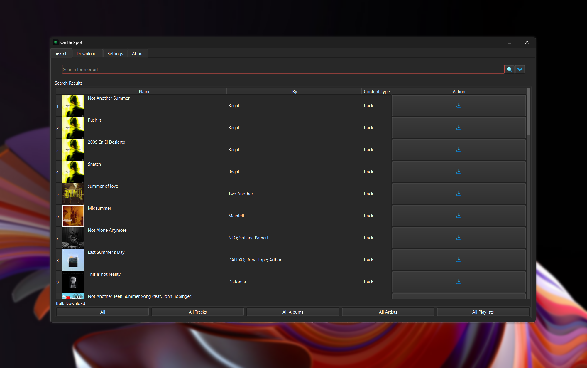

<div align="center">

<div style="text-align: center;">
  <picture>
    <source media="(prefers-color-scheme: dark)" srcset="assets/01_Logo/Repository-Logo.png">
    <source media="(prefers-color-scheme: light)" srcset="assets/01_Logo/Repository-Logo.png">
    
  </picture>
</div>

[![Issues Badge][issues-shield]][issues-url]
[![Stars Badge][stars-shield]][stars-url]
[![Downloads Badge][downloads-shield]][downloads-url]
[![License Badge][license-shield]][license-url]

   <p>
      Welcome to OnTheSpot!
      <br />
      <a href="https://discord.gg/GCQwRBFPk9">Join Discord</a>
      ·
      <a href="https://github.com/justin025/OnTheSpot/issues/new?assignees=&labels=bug&projects=&template=bug-report.yml">Report Bug</a>
      ·
      <a href="https://github.com/justin025/OnTheSpot/issues/new?assignees=&labels=enhancement&projects=&template=feature_request.yml">Request Feature</a>
   </p>
   <br>
</div>

Yet another music downloader written in Python. OnTheSpot has support for various music services and, unlike similar projects, downloaded files and metadata are sourced directly from the service of your choosing. The app includes a GUI, CLI, and Web UI frontend. To get started download the app [here](https://github.com/justin025/onthespot/releases/latest) or run the command below.
```bash
python -m pip install git+https://github.com/justin025/onthespot
```
To begin, please refer to the following documents:

1. [**Installation Guide**](docs/installation.md)
2. [**Basic Usage Instructions**](docs/usage.md)


# Screenshots



### Need More Help?

If you have any questions or run into issues while using OnTheSpot, feel free to ask by:

- [**Opening an Issue**](https://github.com/justin025/onthespot/issues)
- [**Joining Our Discord**](https://discord.gg/GCQwRBFPk9)

## Contributing

Contributions are welcome! If you encounter bugs, have suggestions, or would like to translate the app to your native language feel free to [**open an issue**](https://github.com/justin025/onthespot/issues) or submit a pull request.

For more detailed info, please read our [**Contributions**](docs/contributing.md) Document.

## Disclaimer

OnTheSpot is an open-source project designed to enhance your experience with legitimate music streaming subscriptions for **educational and personal use only**.

For full details, please read our [**Disclaimer**](docs/disclaimer.md).

<!-- Issues Badge -->
[issues-shield]: https://img.shields.io/github/issues/justin025/onthespot?style=flat&label=Issues&labelColor=001224&color=1DB954
[issues-url]: https://github.com/justin025/onthespot/issues
<!-- Stars Badge -->
[stars-shield]: https://img.shields.io/github/stars/justin025/onthespot?style=flat&label=Stars&labelColor=001224&color=1DB954
[stars-url]: https://github.com/justin025/onthespot/stargazers
<!-- Downloads Badge -->
[downloads-shield]: https://img.shields.io/github/downloads/justin025/onthespot/total.svg?style=flat&label=Downloads&labelColor=001224&color=1DB954
[downloads-url]: https://github.com/justin025/onthespot/releases/
<!-- License Badge -->
[license-shield]: https://img.shields.io/github/license/justin025/onthespot?style=flat&label=License&labelColor=001224&color=1DB954
[license-url]: https://github.com/justin025/onthespot/blob/main/LICENSE
