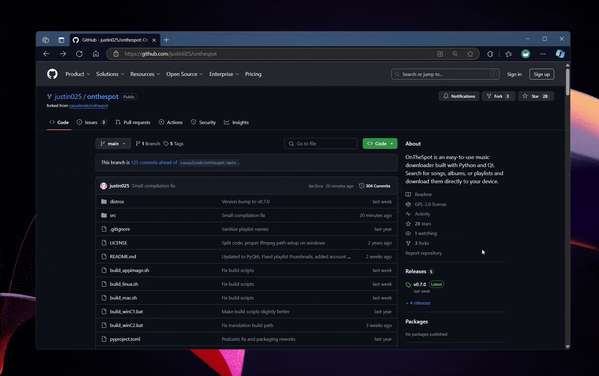

<picture>
  <source media="(prefers-color-scheme: dark)" srcset="../assets/01_Logo/Cover_White.png">
  <source media="(prefers-color-scheme: light)" srcset="../assets/01_Logo/Cover_Black.png">
  
</picture>

<br>

# Installing

We've made the installation process really straightforward, even if you're new to this. You can install OnTheSpot using the two methods listed below. We think you'll find the first option easier.

It's quite easy.

## 1. Install via GitHub Releases (Recommended)

This is the easiest way to get started.

1. **Download the Latest Release**

   - Visit our [GitHub Releases Page](https://github.com/justin025/onthespot/releases).
   - Look for the latest version suitable for your operating system:
     - **Windows Users**: Download the `.exe` file.
     - **MacOS Users**: Download the `.dmg` file.
     - **Linux Users**: Download the `.AppImage` or `tar.gz` file.

2. **Install OnTheSpot**

   - **Windows**: Run the downloaded `.exe`.
   - **MacOS**: Open the `.dmg` and drag `OnTheSpot.app` into your `Applications` folder.
   - **Linux**: Make the `.AppImage` executable and run it, alternatively extract the tar.gz and execute the binary.

> [!TIP]
> For MacOS, if you encounter security warnings, right-click the app and select "Open" from the context menu to bypass the gatekeeper.

3. **Launch OnTheSpot**

   - Open the application from your Downloads folder or Applications menu.



## 2. Build the Package Locally via Script

If you prefer to build OnTheSpot yourself, follow these steps.

1. **Install Python and Download the Source Code**

   - Installing python can vary depending on your operating system.
   - The source code can be downloaded through github or through the commands below:

     ```bash
     git clone https://github.com/justin025/onthespot
     cd onthespot
     ```

2. **Run the Build Script for Your Operating System**

   - **Windows**: Open the `scripts` Folder. Double-click [`build_windows.bat`](scripts/workflow/build_windows.bat) or run it in Command Prompt.
   - **MacOS**: Run [`build_mac.sh`](scripts/workflow/build_mac.sh) in Terminal with `./scripts/workflow/build_mac.sh`.
   - **Linux**: Run [`build_linux.sh`](scripts/workflow/build_linux.sh) in Terminal with `./scripts/workflow/build_linux.sh`.
   - **Linux AppImage**: Run [`build_appimage.sh`](scripts/workflow/build_appimage.sh) in Terminal with `./scripts/workflow/build_appimage.sh`.

> [!WARNING]
> Make sure to run the correct script for your platform to avoid any build failures.

3. **Install and Launch OnTheSpot**

> [!TIP]
> After building the application will be located in the `dist` folder. Be sure to follow installation steps based on your operating system.
